#  <h1>
**SENA**
</h1>

## <h2>SERVICIO NACIONAL DE APRENDISAJE </h2>
(CENTRO INDUSTRIAL Y DE AVIACION)

INFORME DE ANALISIS  
Presentado por: 
Juan David Sarmiento Dìaz  
Katryn Johana González Rodríguez 
Geronimo jose castillo martinez 
Thomas David Güette Marriaga 
Maiyer David Hernández Nietoa 

**
HISTORIAL DE REVISIONES
**
|fecha | versiòn | descripciòn/cambio | autor|
|------|---------|--------------------|------|
|07/07/2023   25/07/2023|1.0   1.1| Primer documento.   actualizaciòn de documento.| Juan David Sarmiento Dìaz.   Katryn Johana González Rodríguez.   Geronimo jose castillo martinez.   Thomas David Güette Marriaga.   Maiyer David Hernández Nieto.

1. **PROPOSITO.**  

El propósito de este documento de análisis es dar a conocer los requerimientos
funcionales con sus estructuras para que puedan ser utilizadas en la fase de diseño
del proyecto formativo.

2. **ALCANCE.**  

Realizaremos una tienda web con inventario, que permitirá llevar a cabo el control
sobre la entrada y salida de los productos que se registran en la farmacia (famisalud
la 91), se llevará a cabo la venta de estos mismos todo esto con el fin de poder
mejorar las ventas y la organización, en este proyecto no realizaremos la instalación
ni haremos el mantenimiento del software.

3. **DEFINICIONES, ACRONIMOS Y ABREVIATURAS**  

**SENA:** Servicio Nacional de Aprendizaje.  

**Web:** Un sitio web, portal o cibersitio es una colección de páginas web relacionadas y comunes a un dominio de internet o subdominio en la World Wide Web dentro de Internet.  

**Sofía:** Sistema Optimizado para la Formación Integral del Aprendizaje Activo.  

**Base de datos:** una base de datos se encarga no solo de almacenar datos, sino también de conectarlos entre sí en una unidad lógica.  

**Software:** Estos son los programas informáticos que hacen posible la ejecución de
tareas específicas dentro de un computador. Por ejemplo, los sistemas operativos, aplicaciones, navegadores web, juegos o programas.  

**inventario:** El inventario es la comprobación manual de que las cantidades físicas y reales en stock de cada producto de nuestra farmacia coinciden con las cantidades
de cada producto registrados en el programa informático de gestión.  

**Firewall:** es un sistema de seguridad de red de las computadoras que restringe el tráfico de Internet entrante, destaca o dentro de una red privada.  

**Requerimientos funcionales:** descripción de las capacidades o funciones que el sistema será capaz de realizar.  

**Requerimientos no funcionales:** restricciones o características que delimitan el sistema, como, por ejemplo, rendimiento, interfaces de usuario, confiabilidad, seguridad, portabilidad, normas, entre otros.  

4. **PERSONAL.**  

|**NOMBRE**|**CORREO**|**TELEFONO**|
|----------|----------|------------|
|Katryn Johana gonzálezRodríguez |katrinjhoanagonzalezrodriguez@gmail.com|3022349798|
|Geronimo jose castillo martinez |jeromartinezcas21@gmail.com|3206926305|
|Thomas David Güette Marriaga|thomasmarriaga487@gmail.com|3003687800|
|Maiyer David Hernández Nieto|maiyerhernandezn@gmail.com|3046722344|
|Juan David Sarmiento Díaz|jjuandsarmiento04@gmail.com|3042285552|

5. **SITUCACION ACTUAL.**  

La empresa Famisalud 91 en la actualidad esta administrada por Duvis González quien es la propietaria del negocio, la cual maneja la empresa con la ayuda de su esposo quienes son los únicos que administran el negocio.  

La empresa no cuenta con ningún tipo de software que ayude a facilitar, mejora y dar mayor eficacia al manejo de la empresa, lo que lleva a dar déficit en varias áreas de esta.  

Unas de las áreas que puede presentar déficit puede ser el área de inventario debido a que los productos de entrada y salida son registrados. 
manualmente en libretas u otras herramientas y esto puede llevar a la perdida de información, En el área de contabilidad se presentan dificultades
a la hora del manejo de las cuentas debido a que se hace manualmente esto puede llevar a ineficacia a la hora de llevar la contabilidad de la empresa. 

Debido a las dificultades que viene presentando la farmacia famisalud la 91 surge la necesidad de diseñar una tienda web para esta que ayude a mejorar algunos de los problemas que la empresa presenta. Con este software se busca disminuir, cambiar o minimizar lo más posible las problemáticas que vienen presentando la empresa, haciendo que esta tenga una mayor eficacia en la mayor parte de sus áreas, facilitando el trabajo y mejorando las ventas.  

6. **PERSPECTIVA DEL PRODUCTO.**  

De este software se espera tener una mejora en el área de las ventas y la administración de la empresa. Se busca facilitar el trabajo administrativo sin disminuir las ventas y brindando una mayor eficacia.  

Lo que llevara al aumento de los clientes y mayor ingreso monetario al
negocio.  

El inventario hará que se lleve de mejor manera la información de los productos de entrada y salida, previniendo la perdida de información.  

7. **FUNCIONES DEL PRODUCTO.**  

 Registro de Inventario  
 inicio de sesión  
 Módulo de carrito  
 registro de usuario  
 modulo método de pago  
 módulo de productos  
 Modulo principal  

8. **CARACTERISTICAS DE USUARIO.**  

Los usuarios serán los clientes, los empleados y los administradores.  

Los clientes tendrán acceso a la visualización y compra de los productos que se encuentran disponibles.  

Los empleados tienen acceso al registro de los productos que ingresan y salen de la farmacia y al apartado de los pedidos y las ventas realizadas en físico.  

El administrador tendrá acceso a las ventas y al registro de los productos.  

9. **REQUERIMIENTOS FUNCIONALES.**  

|CODIGO|NOMBRE|
|------|------|
|RF-001|Registro de Inventario|
|ALTO|Debe permitir al administrador mostrar los productos y la cantidadcon la que dispone de cada uno de estos|
|RF-002|inicio de sesión|
|ALTO|Debe permitir al usuario iniciar sesión con un tipo de usuario ya sea(Administrador, empleado o cliente) |
|RF-003|Módulo de carrito|
|MEDIO|permite al usuario agregar productos al carrito y apartar un productosin la necesidad de llevárselo enseguida|
|RF-004|registro de usuario|
|ALTO|permite al usuario registrase en el sistema, como cuenta tipo(usuario)|
|RF-005|modulo método de pago|
|ALTO|permite al usuario seleccionar la forma de pago del producto|
|RF-006|módulo de productos |
|ALTO|detalles de cada producto para su organización|
|RF-007|Modulo principa|
|ALTO|En este requerimiento se va a organizar la página principal a la cual van a acceder los usuarios después de iniciar sesión|

10. **REQUERIMIENTOS NO FUNCIONALES**  

|CODIGO|NOMBRE|
|------|------|
|RNF-001|Rendimiento del programa |
|ALTO|El programa debe tener el mejor rendimiento, la mejor velocidad de carga y el mejor desempeño posible para dar una buena satisfacción a cada uno de lo usuarios |
|RNF-002|Protección de información |
|ALTO|El programa debe garantizar la seguridad de la información que los usuarios ingresan|
|RNF-003|Sostenibilidad del programa|
|ALTO|El programa debe tener la capacidad de mantenerse activo y funcionando a su 100% si llega a presentar alguna falla debe ser capaz de recuperarse en el menos tiempo posible sin afectar de ninguna forma a los usuarios |
|RNF-004|Usabilidad |
|ALTO|La interfaz del programa debe ser lo más clara y sencilla posible para que a los usuarios se le facilite su manejo de la mejor manera|
|RNF-005|Eficacia |
|ALTO|El programa de brindar la mejor eficacia para mayor satisfacción y para una mejor experiencia de parte de los usuarios|
|RNF-006|Restricciones |
|ALTO|El programa debe tener ciertas restricciones dependiendo del rol con el que se esté acabó el programa|

11. **MODELO ENTIDAD RELACION**  

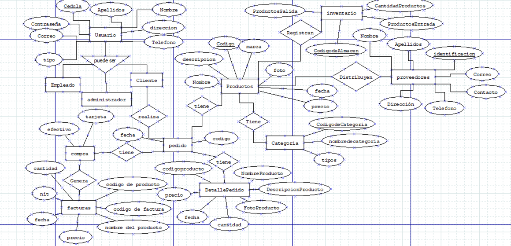

12. **DIAGRAMA CASOS DE USO (UML)**  

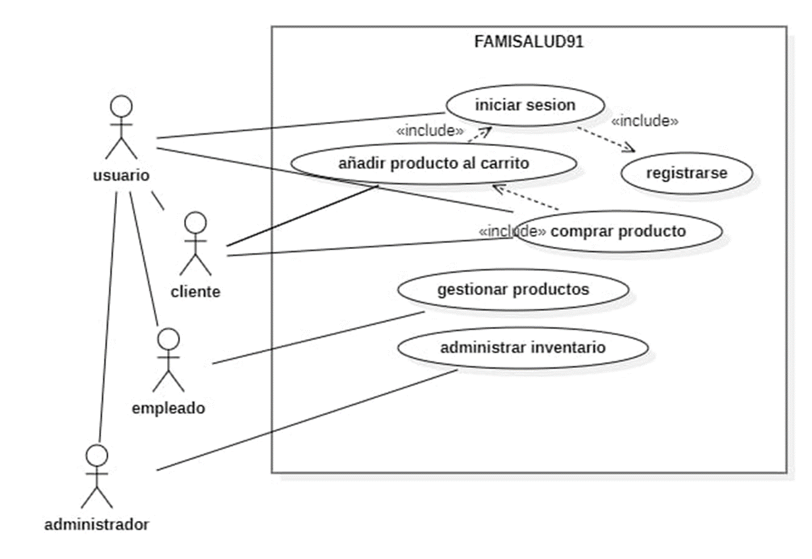
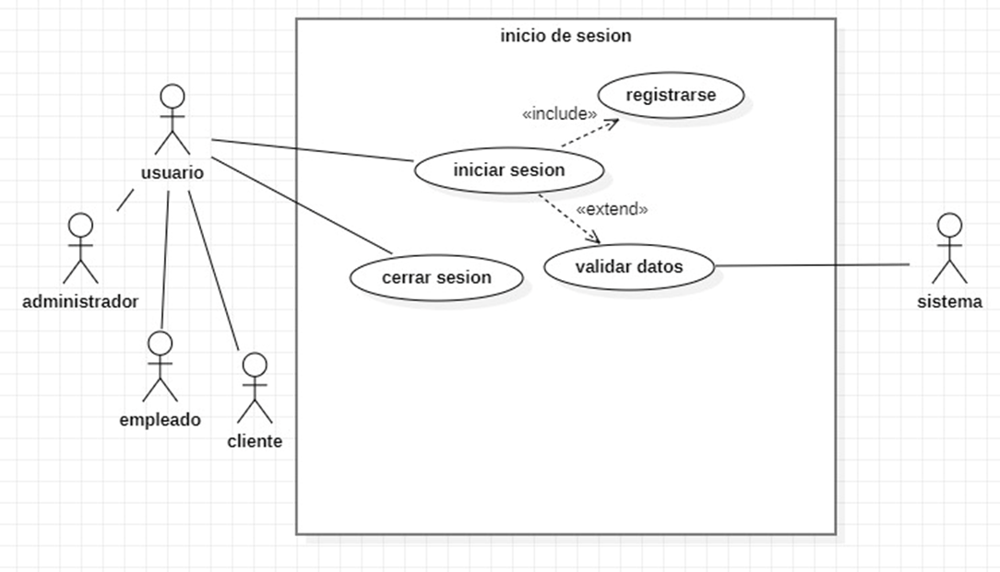
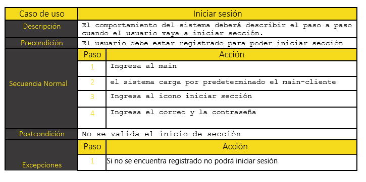
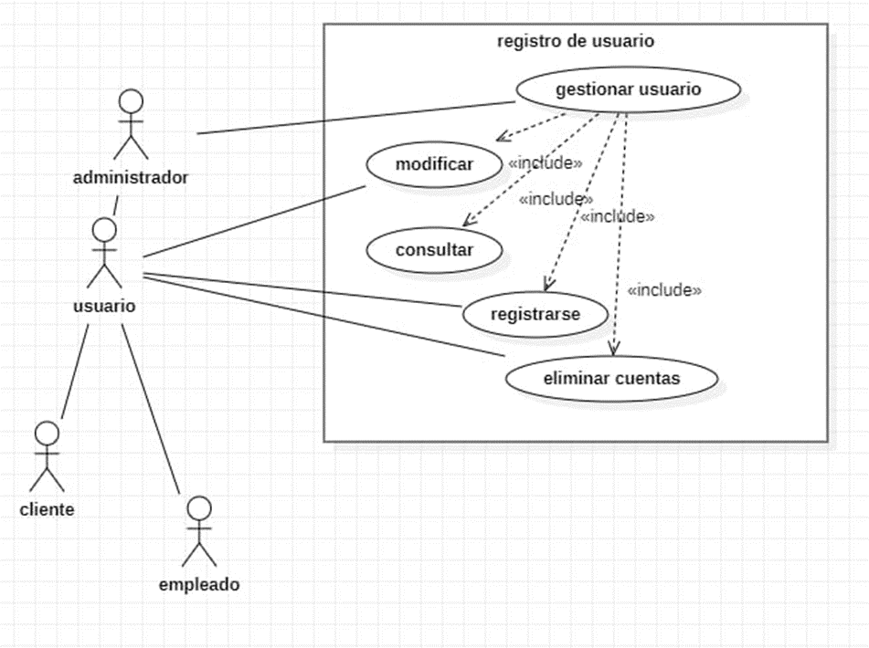
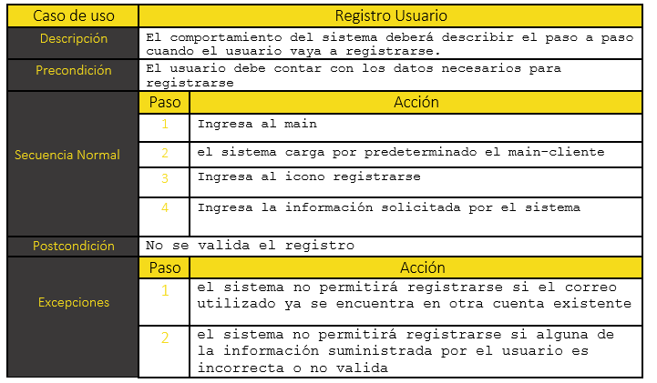
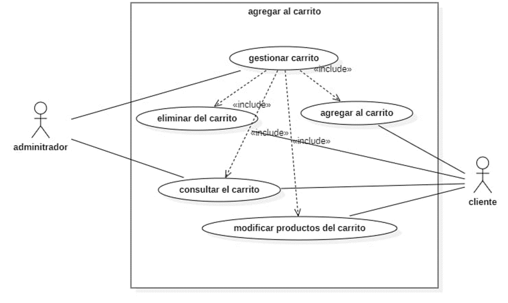
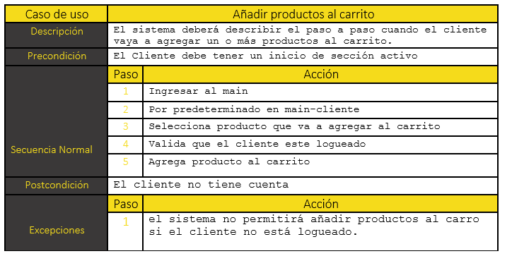
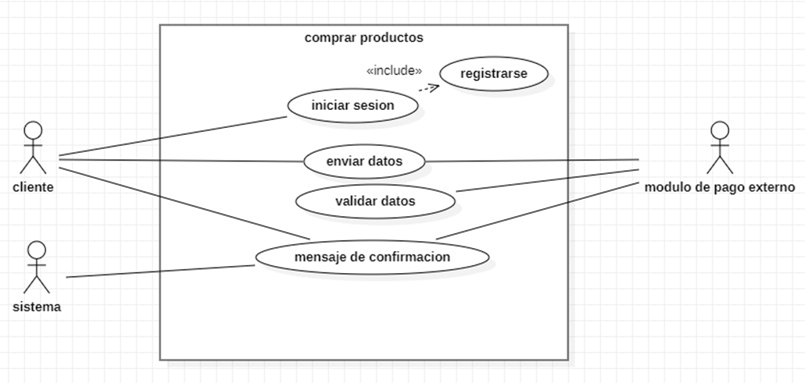
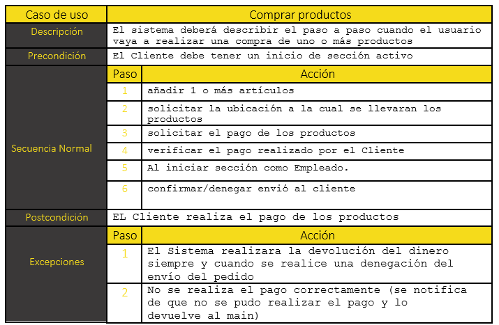
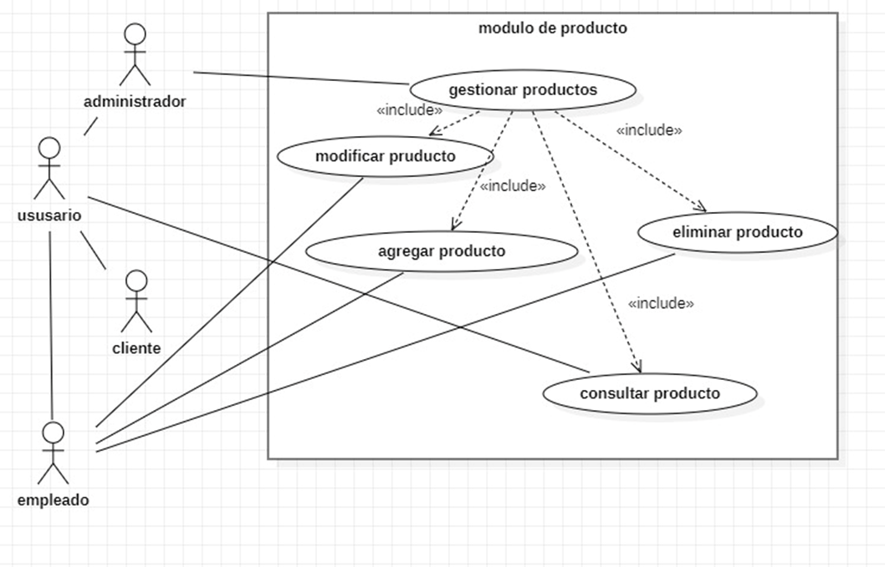
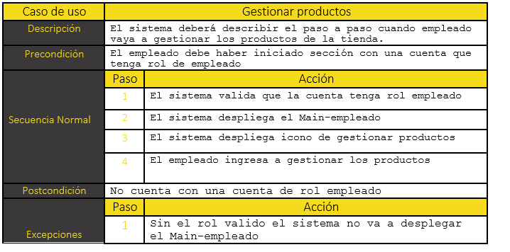
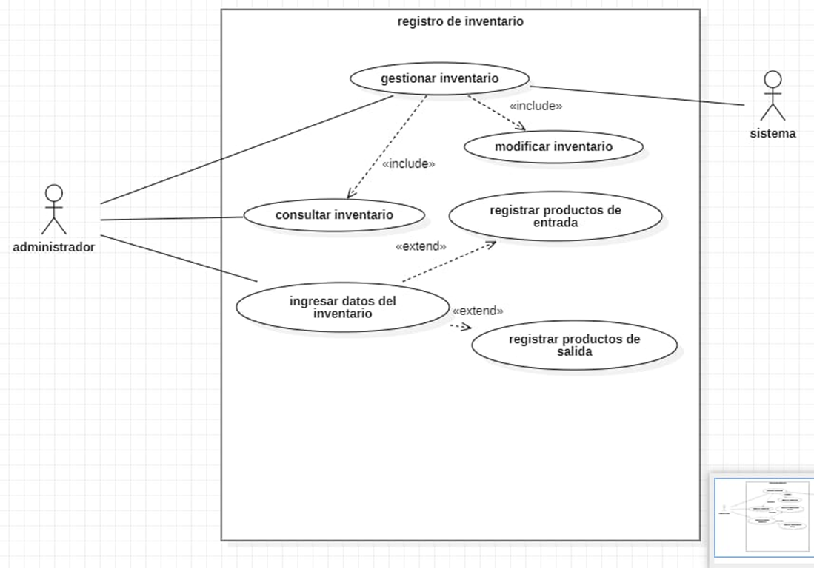
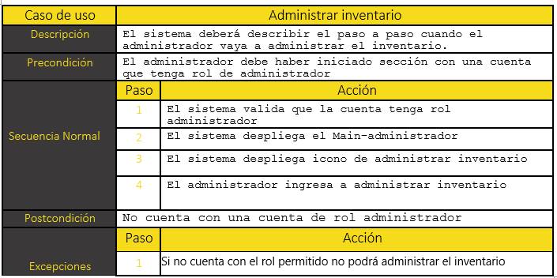

13. **DIAGRAMA DE ACTIVIDADES (UML)**  

Agregar productos al carrito

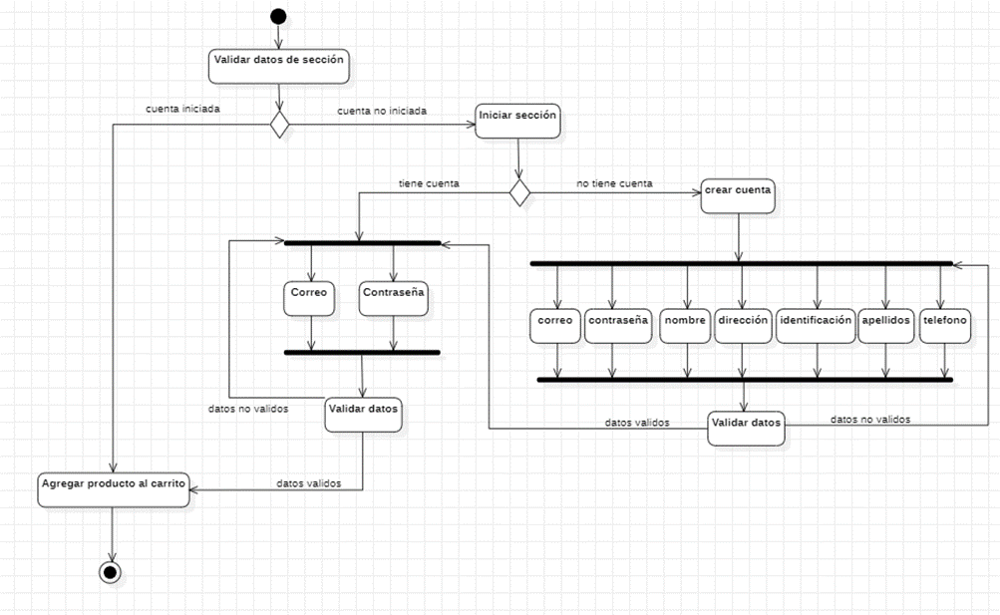

Registrar Usuario

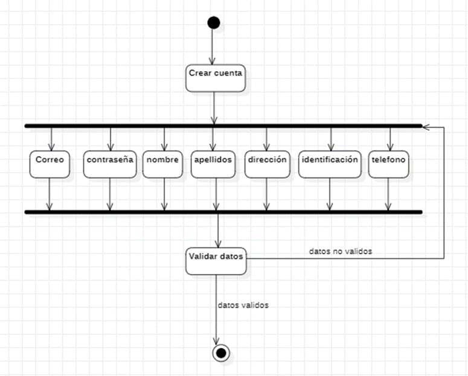

Iniciar sesión

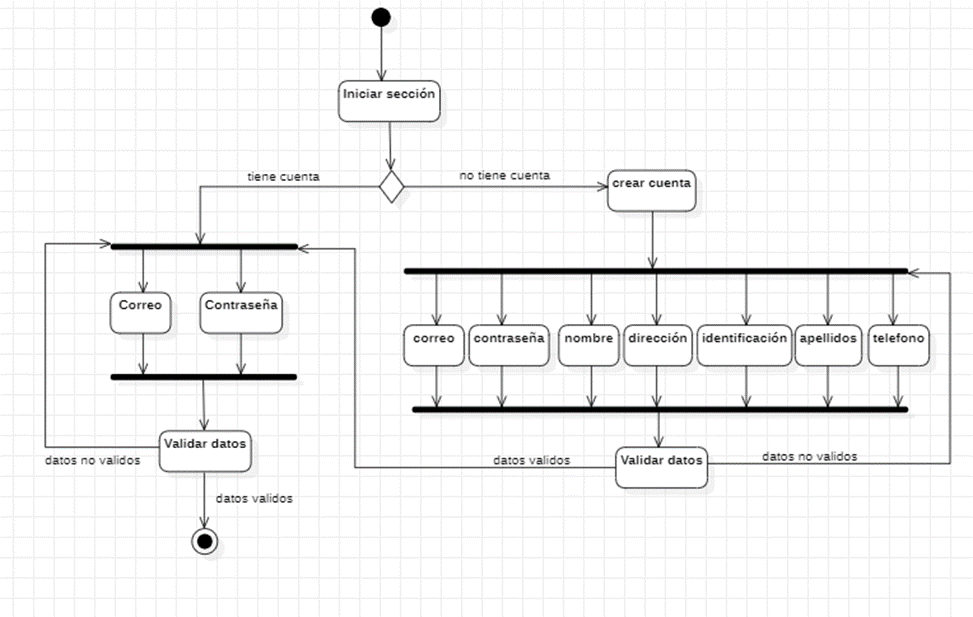

Administrar inventario

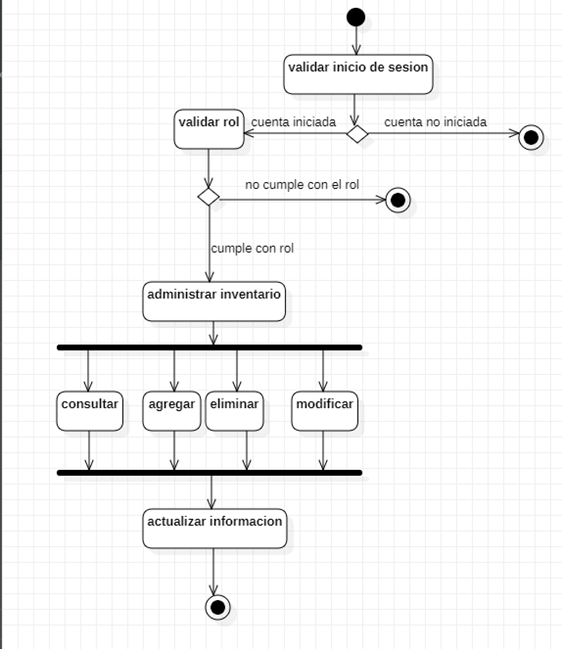

Comprar productos

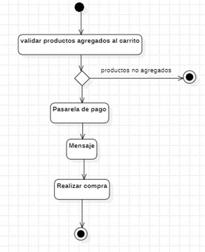

Gestionar productos

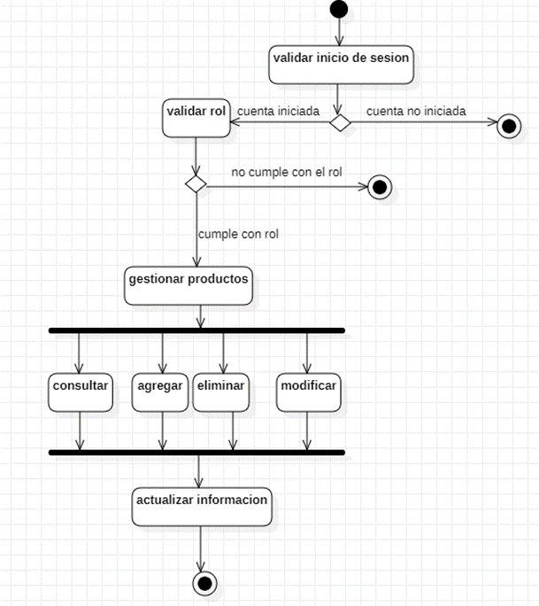

14. **DIAGRAMA DE CLASES (UML)**  

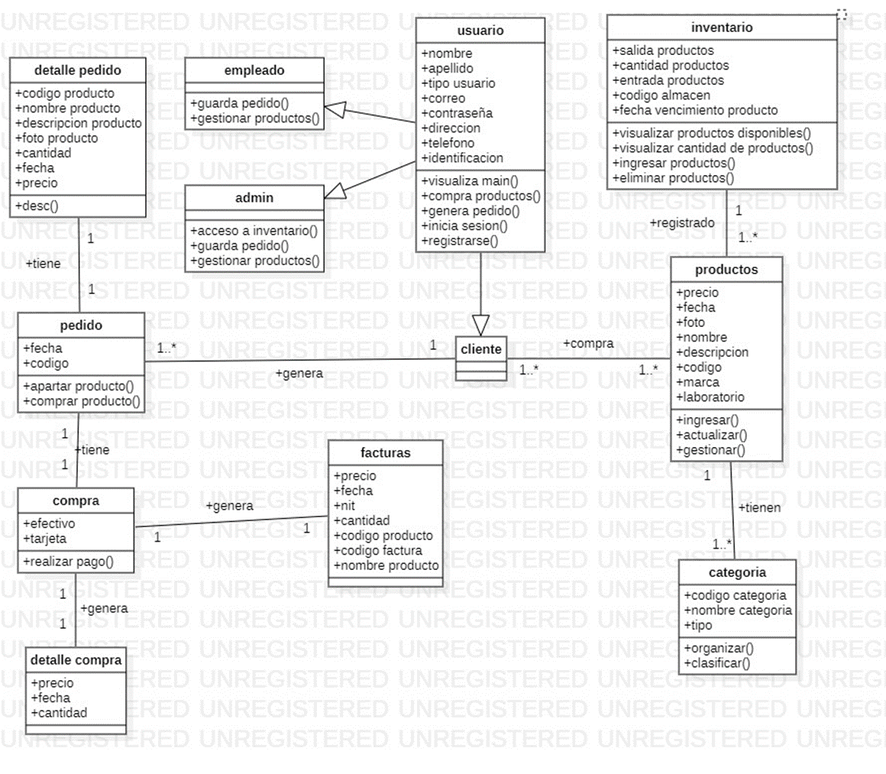